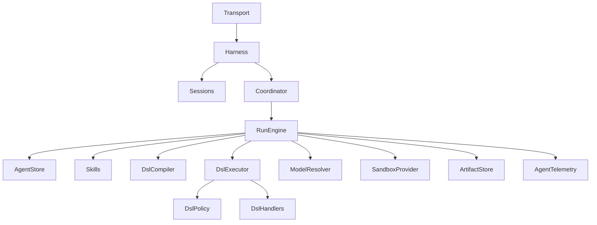

# Plan: Effect-first, DSL-first agent harness

## Context

Build an application-owned agent harness that can run the same typed agent definitions in product servers, Google Chat, GitHub Actions/CLI, workers, and deterministic tests by changing Effect `Layer`s.

The harness will be **DSL-first** rather than accepting arbitrary product toolkits. Effect AI remains the provider-neutral model implementation, but is localized behind the harness. The model-visible core surface is intentionally tiny:

- `loadSkill({ name })` for progressive disclosure of instructions.
- `executeDsl({ source })` for one single-line chained DSL expression.

An engineering parent agent can additionally use the DSL terminal `agents.delegate({ task: string })`. A delegated child runs synchronously in the **same sandbox/workspace**, receives the parent's effective DSL except `agents.delegate`, cannot delegate recursively, and returns only its final text to the parent. Internally it remains a durable, independently observable child run.

The first end-to-end product scenario is a Google Chat thread asking the engineering agent to investigate an issue/PR, prepare or review changes, run validation, request approval for consequential GitHub mutations, and report back in the same thread.

### Fixed design decisions

- A Google Chat `space + thread` maps durably to one agent session.
- Sessions use append-only entries with `parentEntryId` and an `activeLeafId`; branching and compaction never rewrite history.
- Each accepted message creates or queues a run; model execution proceeds one provider turn at a time.
- DSL source is exactly one expression on one line: no variables, assignments, semicolons, control flow, imports, comments, recursion, or arbitrary JS/TS.
- DSL execution validates the complete chain before effects, produces an inspectable pure plan, authorizes every operation, executes sequentially, and renders the final value as text automatically.
- Skills are typed descriptors plus Markdown content; they are neither Layers nor executable tools. Initially the model sees only skill names/descriptions and loads full instructions on demand.
- Domain DSL definitions are separate from handlers. Handlers are supplied by Layers and call existing application services/ports, never transport or SQL directly.
- A skill may document a DSL subset but cannot grant authority.
- Sandbox and child delegation are orthogonal to permissions. All operations are authorized at execution time.
- Child delegations share the parent's sandbox and are sequential in the first version to avoid concurrent workspace writes.
- GitHub credentials never enter the sandbox. Host-side capability adapters use short-lived GitHub App installation credentials.
- Persist before publishing live notifications; streams are projections over durable sequence cursors, not process-local sources of truth.
- Effect AI `LanguageModel`, `Model`, `ExecutionPlan`, `Prompt`, `Response`, `Tool`, and `Toolkit` are reused internally; no duplicate provider abstraction is introduced.

## Approach

### 1. Establish the package boundary and vocabulary

Create a reusable core package, `@proxus/agent-harness`, for pure schemas, DSL/compiler, session/run semantics, ports, and Effect services. Put concrete persistence, Effect AI, GitHub, sandbox, skill-file, artifact, and telemetry adapters in the existing `@proxus/backend-infra` package under `src/modules/agent-harness/`.

This follows the repository's existing domain/infra split and avoids creating a second generic infrastructure package. Standalone CLI/CI/worker apps consume narrow `@proxus/backend-infra/agent-harness/*` exports, while adapter selection and Layer composition stay in each app's composition root. Product DSL handlers still adapt public bounded-context services rather than importing their internals.

Document these distinct terms:

- **Agent definition:** typed prompt, skill descriptors, DSL definition, model profile, and run limits.
- **Session:** durable conversational history and active branch.
- **Run:** one accepted execution within a session.
- **Turn:** one provider invocation followed by DSL settlement.
- **Entry:** append-only session node.
- **Journal event:** ordered operational fact about a run.
- **Checkpoint:** reconstructable run snapshot through a journal sequence.
- **Skill:** progressively disclosed instructions and references.
- **DSL definition:** typed grammar graph and operation schemas.
- **DSL handler:** Layer-provided implementation of an operation.
- **Sandbox:** scoped workspace/process boundary.
- **Authority:** runtime permission to perform one concrete operation.

### 2. Define typed agent, skill, and model descriptors

Use literal-preserving constructors instead of open strings:

```ts
const IssueInvestigation = Skill.define({
  id: "issue-investigation",
  description: "Investigate a GitHub issue using repository evidence"
})

const CodingModel = ModelProfile.define({
  id: "coding",
  requirements: { tools: true, largeContext: true }
})

const EngineeringAgent = Agent.define({
  id: "engineering",
  prompt: { instructions: "..." },
  skills: [IssueInvestigation, PullRequestReview, ImplementIssue],
  dsl: EngineeringDsl,
  model: CodingModel,
  runPolicy: { maxTurns: 30, maxDslExecutions: 50, maxDelegationDepth: 1 }
})
```

Agent definitions are immutable values. Model profiles are logical typed references; composition roots map them to concrete Effect AI model/`ExecutionPlan` Layers. Skill content is decoded with `Schema`; production uses directory-backed Markdown and tests use in-memory content.

### 3. Implement the constrained typed DSL

Build declarations for roots, intermediate contextual types, methods, and terminal operations. The compiler must derive model guidance and runtime validation from the same definitions.

Grammar:

```text
program   := root call+
call      := "." identifier "(" arguments? ")"
arguments := JSON-compatible literals
```

Compiler pipeline:

```text
reject multiline/forbidden syntax
→ parse one chain
→ resolve root and each contextual transition
→ decode every argument with Effect Schema
→ verify terminal output
→ enforce source/chain/cost limits
→ emit pure CompiledDslPlan
```

The plan contains operation IDs, decoded inputs, operation kind, approval metadata, definition versions, and estimated cost; it contains no handlers, clients, Layers, closures, or secrets.

Adopt agent-orm's strongest invariant: the entire chain is valid before the first effect. Return structured, self-correctable errors containing code, location, expected type, available methods, suggestions, and hint.

Initial restrictions:

- maximum source length and chain length;
- multiple queries but at most one mutation per expression;
- no dynamic operation names;
- bounded output size with artifact references for large results;
- automatic textual rendering of the final chain value;
- no `.print()` or `return` syntax.

### 4. Separate DSL declarations, policy, and handlers

Provide a typed `DslDefinition` and handler constructor analogous to `Toolkit.toLayer`, requiring every operation to have a correctly typed implementation while preserving Effect error and dependency types during construction.

Runtime pipeline for each compiled operation:

```text
resolve registered definition/version
→ verify deployment availability
→ validate concrete arguments
→ authorize actor/resource
→ bind or validate approval
→ execute handler
→ validate/encode result
→ append journal transition
```

The public `executeDsl` Effect AI tool has only `{ source: string } -> string`. It is owned by the harness and bound to the current agent's compiled DSL. Product agents do not receive arbitrary toolkits.

Define engineering DSL modules for the first scenario:

- `github.repository(...).issue(...).inspect()`
- `github.repository(...).pullRequest(...).review()`
- repository search/read/status/diff/apply-patch operations;
- validation discovery/run/output operations;
- local git branch/commit operations;
- approved GitHub push/PR/comment/review operations;
- `agents.delegate({ task })` as a terminal operation.

Keep DSL syntax ergonomic but make operation IDs stable and independent from display paths for persistence and policy.

### 5. Add simple progressive skills

Implement a small `Skills` service with `list` and `load`; production discovers configured `SKILL.md` files while tests provide values. Do not add remote registries, dependency solving, or skill-owned Layers in the first version.

Initial context contains only permitted skill ID and description. `loadSkill`:

1. confirms the skill belongs to the agent;
2. decodes and loads its body/references;
3. appends `SkillActivated` with content hash to the active session branch;
4. returns instructions to the model for the next provider turn.

Skills teach recipes and subsets of the DSL. They do not register handlers, alter deployment permissions, or grant credentials.

### 6. Model durable sessions, branching, runs, and checkpoints

Use append-only session entries:

```text
Session { id, external binding, activeLeafId, version }
SessionEntry { id, sessionId, parentEntryId, runId, type, payload }
```

Rebuild effective context by walking ancestry from the active leaf, applying only compaction entries valid for that ancestry, then composing platform instructions, agent prompt, activated skills, retained branch entries, and current input.

Support minimal branch operations internally:

- append child entry;
- load ancestry for a leaf;
- set active leaf with optimistic version;
- fork from an entry;
- append compaction summary without deleting source entries.

Model runs as a durable state machine, for example:

```text
Queued → Claimed → Running → WaitingForApproval → Running
                              → Cancelling
       → Succeeded | Failed | Cancelled | TimedOut | BudgetExhausted
```

Process exactly one provider turn at a time, persist its resulting entries/events/checkpoint, then decide `Continue | Suspend | Complete | Fail`. Bound turns, DSL executions, operation count, deadline, tokens/cost, retries, context, output bytes, and child runs.

### 7. Create one deep persistence port with real adapters

Define `AgentStore` as a storage-neutral domain port for atomic lifecycle operations rather than exposing SQL-like CRUD or transaction handles. It owns sessions, entries, runs, ordered journal events, checkpoints, inbox deduplication, leases, and optimistic versions where they must commit together.

Critical atomic transition:

```text
expected run/session version
+ append journal/session entries
+ update run/session state
+ optional checkpoint
= one commit
```

Adapters:

- fresh in-memory state for domain tests;
- SQLite for local/CLI/GitHub Actions and adapter contract tests;
- PostgreSQL for product, Google Chat, distributed workers, leases, and recovery.

Keep rows, migrations, locking, SQL clients, and driver errors inside infra. Reuse one client/pool Layer value by identity. Add a shared contract suite over memory, SQLite, and PostgreSQL covering ordering, optimistic conflicts, atomic append, deduplication, branch ancestry, checkpoint consistency, claims, lease expiry/fencing, cancellation, rollback, and replay from cursor.

Introduce a separate `ArtifactStore` only because filesystem/object storage and retention differ materially from transactional run storage. Large diffs, logs, reports, and DSL outputs become ACL-protected artifact references.

### 8. Implement run coordination and live observation

`RunCoordinator` handles admission wakeups, claims, leases, heartbeats, cancellation, orphan recovery, worker concurrency, and graceful shutdown. Start with a local coordinator over memory/SQLite and add a PostgreSQL worker coordinator with fencing before multi-replica product deployment.

A `RunEventHub` is only a wakeup/live optimization. Persist transitions first, then notify. Clients subscribe with `afterSequence` and always recover missed data through `AgentStore`.

Expose a small harness interface to transports:

- submit/accept input and return `runId`;
- inspect session/run projections;
- stream events after a cursor;
- cancel;
- resolve approval.

### 9. Implement same-sandbox child delegation

The model-visible API is exactly:

```text
agents.delegate({ task: string }) -> string
```

Runtime behavior:

1. create an observable child run linked by `parentRunId` and `parentStepId`;
2. borrow the parent's `SandboxHandle` and current workspace;
3. inherit current actor, session-relevant context, permissions, skills, and effective DSL;
4. remove `agents.delegate` from the child DSL and enforce depth `< 1` independently;
5. reserve a bounded portion of the parent's budget;
6. execute synchronously/sequentially in the first version;
7. return only the child's final text to the parent;
8. retain structured events, usage, touched paths, commands, policy decisions, and result internally.

Parent cancellation interrupts children. Children do not dispose the shared sandbox. Because the workspace is shared, concurrent delegation is disabled initially; any later read-only parallel mode requires an explicit, enforceable concurrency policy rather than trusting task text.

### 10. Add sandbox and process boundaries

Define a scoped `SandboxProvider` seam with a `SandboxHandle` that exposes only approved workspace/process/artifact operations. Adapters:

- temporary directory/worktree for deterministic tests and local development;
- containerized worker sandbox for product;
- current GitHub Actions workspace adapter for CI.

Product sandbox requirements:

- non-root;
- read-only base filesystem;
- one writable workspace;
- CPU, memory, process, duration, and output limits;
- network denied by default and brokered allowlists where needed;
- no host environment, Docker socket, cloud metadata, or credentials;
- deterministic cleanup through Scope/finalizers.

The sandbox is created once per parent run and shared with delegated children.

### 11. Enforce permissions and approvals outside the model

Model authority is the intersection of:

```text
deployment policy
∩ agent policy
∩ actor/tenant scope
∩ GitHub installation/repository scope
∩ parent delegated authority
∩ operation/resource policy
```

Perform policy checks both when presenting guidance and authoritatively immediately before an operation. Consequential external operations (push, PR creation/update, comments/reviews, merges, deployments) require an approval bound to run, operation ID, compiled plan hash, argument hash, diff hash, and expected base/head SHAs. A changed plan or diff invalidates approval.

Use GitHub Apps instead of PATs. Prefer separate reader and writer Apps/credentials so research children cannot obtain writer authority accidentally. Resolve short-lived installation credentials only inside a host-side GitHub capability adapter; never inject tokens into the sandbox. For Git push, use a host-side broker or controlled credential helper with repository, operation, run, and expected-SHA checks.

### 12. Add observability and run inspection

Keep journal, telemetry, logs, transcripts, and artifacts distinct.

Durable events include IDs, sequence, parent linkage, agent/version, attempt, timestamps, and safe metadata for:

- run/session/turn lifecycle;
- prompt/context compilation fingerprints;
- skill activation;
- DSL submit/compile/authorize/start/complete;
- approvals;
- sandbox/workspace/process lifecycle;
- child delegation lifecycle;
- checkpoints and terminal outcomes.

Add spans for run, turn, model invocation, DSL compilation/operation, approval wait, sandbox process, and child run links. Record low-cardinality metrics for latency, outcomes, token/cost usage, DSL failures, permission denials, approval latency, child counts, sandbox failures, and recovery.

Build a pure run-inspector projection showing objective, model, skills, DSL expressions/plans, operations, resources accessed, files changed, commands, validations, child tree, budgets, artifacts, and final answer. Prompts, raw outputs, reasoning, credentials, and customer data are excluded from normal telemetry; optional encrypted debug payloads require explicit retention/redaction policy.

### 13. Compose Layers for each deployment

Core dependency graph:



Composition roots select adapters explicitly:

- **Tests:** memory store, in-memory skills, scripted `LanguageModel`, deterministic DSL handlers, temporary sandbox, TestClock/IDs, captured telemetry.
- **CI/GitHub Actions:** SQLite store, repository skills, coding model plan, current-workspace sandbox, restricted GitHub App adapter, console/JSON/GitHub-annotation event sink.
- **Google Chat/product:** PostgreSQL store/coordinator, directory/package skills, production model plans, container sandbox, GitHub capability broker, durable artifact store, OpenTelemetry, Google Chat transport/output.
- **Local CLI:** SQLite, local skills, local/container sandbox, explicit model provider, console inspector.

Google Chat transport maps `tenant + space + thread` to a session, deduplicates delivery IDs, queues messages at safe provider-turn boundaries, responds quickly with a run ID/progress, renders approval cards, and posts only safe progress/final output rather than every raw DSL result.

### 14. Deliver in vertical increments

Avoid implementing the complete distributed platform in one change. Deliver in this order:

1. Core typed descriptors, constrained parser/compiler, pure plan, errors, and tests.
2. DSL handler Layer, policy pipeline, `executeDsl`, scripted model, bounded local RunEngine.
3. Skills/loadSkill and append-only in-memory sessions with active branch.
4. In-memory AgentStore contract, journal/checkpoints, cancellation, event projection.
5. Shared-sandbox sequential delegation returning text, with full internal child events.
6. SQLite store and local/CI executable using a temporary sandbox.
7. Engineering DSL vertical: inspect issue/PR, repository read/search/diff, validation, prepare local change.
8. GitHub App broker, approval-bound publish flow, and sandbox hardening.
9. PostgreSQL store, leases/fencing/recovery, durable event cursor, worker executable.
10. Google Chat adapter and end-to-end issue-to-PR scenario.
11. Branch UI/admin run inspector, compaction, production metrics, and opt-in live AI/GitHub smoke tests.

## Files to modify

Critical new/changed paths; exact splits may be refined while keeping these ownership boundaries.

### Documentation and workspace

- `PLAN.md`
- `docs/architecture/agent-harness.md` — normative vocabulary, trust boundaries, diagrams, deployment compositions.
- `docs/effect/ai.md` — update stale pinned-version text and document localized harness ownership of unstable AI APIs.
- `docs/testing.md` — add DSL, store-contract, recovery, sandbox, and deterministic model suites.
- `pnpm-lock.yaml` — exact compatible AI/provider/SQLite dependencies when adapters are introduced.

### Core package

- `packages/agent-harness/package.json`
- `packages/agent-harness/tsconfig.json`
- `packages/agent-harness/src/index.ts`
- `packages/agent-harness/src/agent/*` — typed definitions/catalog/model profiles/run policy.
- `packages/agent-harness/src/dsl/*` — declarations, grammar/parser, compiler, plan, renderer, errors, policy contracts.
- `packages/agent-harness/src/skills/*` — descriptors, content schemas, minimal service, prompt guidance.
- `packages/agent-harness/src/session/*` — sessions, entries, branch reconstruction, compaction model.
- `packages/agent-harness/src/run/*` — state machine, events, budgets, checkpoints, engine, coordinator contracts.
- `packages/agent-harness/src/store/*` — `AgentStore` and `ArtifactStore` ports.
- `packages/agent-harness/src/sandbox/*` — handle/provider contracts.
- `packages/agent-harness/src/delegation/*` — child-run semantics and core DSL operation.
- `packages/agent-harness/src/ai/*` — localized Effect AI turn adapter and internal `loadSkill`/`executeDsl` toolkit.
- `packages/agent-harness/src/observability/*` — safe annotations and inspector projection.
- colocated `*.test.ts` files for all pure/runtime behavior.

### Existing infrastructure package

- `packages/backend-infra/package.json` — add exact adapter dependencies and narrow subpath exports.
- `packages/backend-infra/src/modules/agent-harness/store/memory/*`
- `packages/backend-infra/src/modules/agent-harness/store/sqlite/*`
- `packages/backend-infra/src/modules/agent-harness/store/postgres/*`
- `packages/backend-infra/src/modules/agent-harness/store/test/agent-store-contract.ts`
- `packages/backend-infra/src/modules/agent-harness/skills/filesystem/*`
- `packages/backend-infra/src/modules/agent-harness/ai/effect-ai/*`
- `packages/backend-infra/src/modules/agent-harness/sandbox/temporary/*`
- `packages/backend-infra/src/modules/agent-harness/sandbox/container/*`
- `packages/backend-infra/src/modules/agent-harness/github/*`
- `packages/backend-infra/src/modules/agent-harness/artifacts/*`
- `packages/backend-infra/src/modules/agent-harness/observability/*`
- `packages/backend-infra/src/database/schema/agent-harness/*` and canonical migrations — keep database ownership and migration tooling in the existing infra package.

### First engineering agent and adapters

- `packages/agent-harness/src/examples/engineering/*` initially, promoted to an owning application/domain package once the concrete product boundary is fixed.
- Product/domain-facing DSL handlers in the package that owns each use case; no direct imports of repository implementations.
- `apps/agent-worker/*` — durable worker composition root.
- `apps/agent-cli/*` — local/CI composition root and console/JSON output.
- `apps/google-chat-agent/*` — webhook verification, session binding, approvals, progress/final output.
- `apps/server/src/layers/*` only if the product HTTP surface embeds harness submission/inspection.

## Reuse

- `packages/backend-domain/src/modules/study-catalog/repository.ts` and `service*.ts` — repository/service port pattern and typed errors.
- `packages/backend-infra/src/modules/study-catalog/repository.drizzle.ts`, `repository.pglite.layer.ts`, and `repository.postgres.layer.ts` — adapter separation, mapping locality, and real persistence tests.
- `apps/server/src/layers/http.ts` and server composition roots — central Layer graph and shared Layer identity.
- `docs/effect/services-layers-and-config.md` — service depth, construction-time requirements, resource Layers, exact configuration ownership.
- `docs/effect/ai.md` — Effect AI localization, tool/model limits, privacy, retry, and testing policy.
- `docs/effect/resources-runtime-and-integration.md` and `docs/effect/cli-and-child-processes.md` — scoped runtimes, process supervision, and host integration.
- `.repos/effect-smol/packages/effect/src/unstable/ai/*` — `LanguageModel`, `Model`, `ExecutionPlan`, `Prompt`, `Response`, `Tool`, `Toolkit`, approvals, telemetry.
- `.repos/opencode/packages/core/src/session/*`, `event.ts`, `tool/registry.ts`, `permission.ts`, and `system-context/*` — provider-turn boundary, durable admission, event cursor, materialized tool snapshot, and two-stage authorization concepts.
- `.repos/effect-ai-chat-example/packages/server/src/lib/workflow-run-coordinator.ts` — scoped `prepare → run → finalize`, owner/run separation, and cancellation races; do not reuse its in-memory durability assumptions.
- `../agent-orm/src/dsl.ts` — full-chain validation before effects, contextual method availability, and self-correctable DSL errors; do not copy its closure-based compiled calls or `unknown` typing.
- UsefulSoftwareCo Executor — small stable execution surface, metadata/schema separation, and policy-aware dispatch; do not import its arbitrary code sandbox model.
- Pi concepts only — append-only parent-linked session tree, active leaf, compaction entry, and simple textual child delegation; no Pi SDK dependency.

## Steps

- [x] 1. Write the normative agent-harness architecture document and reconcile the repository's Effect version/provider guidance.
- [x] 2. Add `@proxus/agent-harness` with typed IDs, schemas, errors, agent/skill/model descriptors, and compile-time assertions.
- [x] 3. Implement and fuzz/property-test the one-line chain parser, contextual DSL graph, compiler, plan, renderer, and limits.
- [x] 4. Add typed handler Layers, operation policy/approval contracts, and full validation-before-effects execution.
- [x] 5. Localize Effect AI behind a one-turn adapter and implement the internal `loadSkill` and `executeDsl` toolkit with a scripted model fake.
- [x] 6. Implement bounded `RunEngine`, budgets, cancellation, turn decisions, deterministic events, and checkpoints over an in-memory store.
- [x] 7. Implement append-only sessions, active-leaf branching, ancestry context reconstruction, skill activation hashes, and compaction entries.
- [x] 8. Implement same-sandbox, sequential child delegation with DSL inheritance minus delegation, depth enforcement, budget reservation, textual return, and child event linkage.
- [x] 9. Add agent-harness adapters to `@proxus/backend-infra`: shared store contract, memory adapter, SQLite adapter/migrations, filesystem skills, temporary sandbox, artifacts, and console observability; expose only narrow adapter subpaths.
- [x] 10. Add the local/CI executable and prove a deterministic engineering-agent scenario without live providers.
- [x] 11. Implement the engineering DSL and handlers against public GitHub/repository/validation capabilities, with no credentials inside the sandbox.
- [x] 12. Add GitHub App reader/writer adapters, operation-level authorization, approval binding, idempotency, and safe publish flow.
- [x] 13. Add PostgreSQL store, lease/fencing coordinator, orphan recovery, replay cursors, and worker composition root.
- [x] 14. Add the Google Chat transport, durable thread binding/inbox deduplication, approval cards, progress projection, and final response flow.
- [x] 15. Add run/child inspector projections, OpenTelemetry integration, privacy/retention controls, and production dashboards/alerts.
- [x] 16. Validate boundaries, docs, package exports, shutdown behavior, and all deployment composition roots.

## Verification

### Core DSL and agent semantics

- Compile-time tests reject undeclared skills/models/operations and incomplete or incorrectly typed handlers.
- Parser tests reject newlines, assignments, variables, semicolons, multiple expressions, unsupported literals, control flow, dynamic names, excessive source, and excessive chain depth.
- Compiler tests prove contextual method transitions, all-arguments decoding, one-mutation limit, deterministic plans/fingerprints, useful suggestions, and zero effects on any compilation failure.
- Renderer tests bound/redact textual output and replace large values with artifact references.

### Run/session/delegation

- Scripted-model tests cover multi-turn continuation, finish, model failure, timeout, cancellation, repeated DSL call detection, every budget, and unknown usage.
- Session tests cover append, active leaf, forks, ancestry, branch-specific skills/compaction, optimistic conflicts, and context rebuilding after restart.
- Delegation tests prove same sandbox visibility, child edits visible to parent, sequential execution, parent cancellation propagation, child inability to delegate both by missing DSL operation and depth guard, budget reconciliation, and text-only model-visible result.
- Approval tests cover approve/deny/expiry/restart and invalidate approval after any plan, argument, SHA, or diff change.

### Persistence

- Run the identical `AgentStore` contract against memory, SQLite, and PostgreSQL.
- Inject crashes between intent, external effect, journal append, checkpoint, and terminal transition; verify idempotent recovery or explicit safe failure.
- Test competing claims, stale leases, fencing, heartbeat loss, cancellation, owner/session ordering, delivery deduplication, replay after cursor, and multi-process behavior in PostgreSQL.
- Test migrations from empty storage and startup refusal on pending production migrations.

### Sandbox and GitHub

- Verify filesystem allowlists, shared parent/child workspace ownership, finalizer cleanup, process cancellation, timeout, output bounds, CPU/memory limits where supported, denied network, absent host secrets, and no Docker socket.
- Contract-test GitHub reader/writer separation, installation repository scope, short-lived credentials, expected-SHA conflicts, idempotent PR/comment creation, safe error mapping, and credential redaction.
- Keep live GitHub/provider tests opt-in, secret-gated, rate-limited, and non-blocking for deterministic suites.

### Deployment flows

- **CLI/CI:** a scripted model inspects a fixture issue/repository, delegates a child in the same workspace, prepares a patch, validates it, emits console/JSON output, and persists/reopens the SQLite run.
- **Google Chat:** signed webhook fixture maps a thread to a session, deduplicates delivery, resumes context after process restart, starts a worker run, renders child progress and approval, publishes an idempotent PR through fake GitHub, and posts the final answer to the same thread.
- **Product worker:** PostgreSQL restart/recovery test proves an admitted or approval-waiting run is not lost and events replay from the last cursor.

### Repository commands

Run proportionally per increment, culminating in:

```bash
pnpm effect:diagnostics
pnpm --filter @proxus/agent-harness typecheck
pnpm --filter @proxus/agent-harness test
pnpm --filter @proxus/backend-infra typecheck
pnpm --filter @proxus/backend-infra test
pnpm --filter @proxus/agent-cli test
pnpm --filter @proxus/agent-worker test
pnpm --filter @proxus/google-chat-agent test
pnpm typecheck
pnpm test
pnpm build
```

Provider and GitHub live smoke commands must be separate and opt-in; they are never the deterministic acceptance gate.
