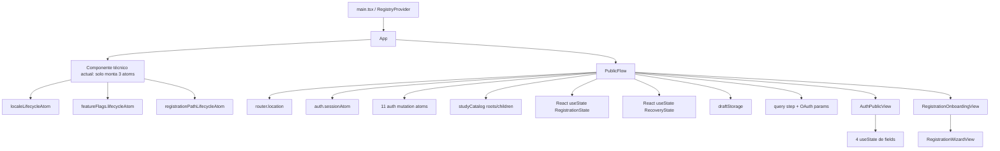
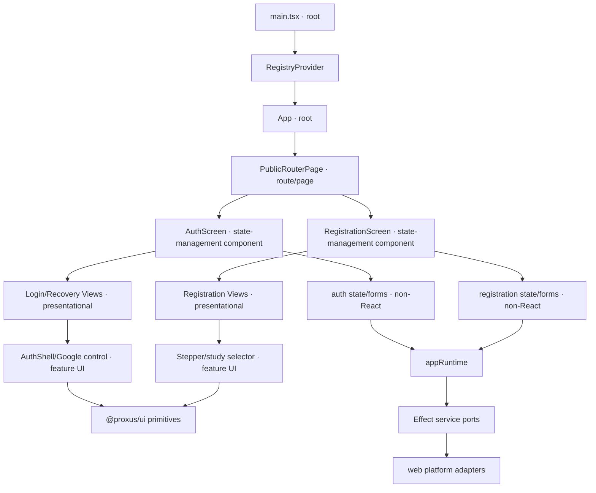
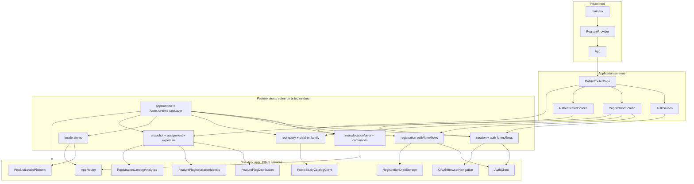
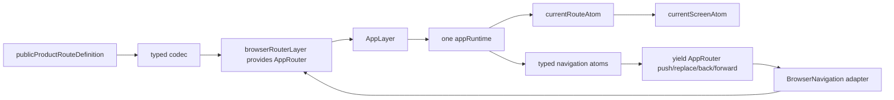
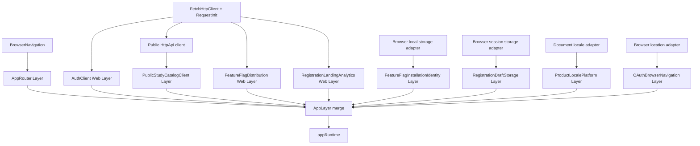

# Plan de estabilización de la aplicación web

## Context

La aplicación web concentra actualmente en `apps/web/src/App.tsx` la coordinación de routing, sesión, autenticación, recuperación de contraseña, OAuth, registro, catálogo, persistencia y renderizado. El registro tiene ownership repartido entre estado React, atoms de `frontend-core`, query params y `sessionStorage`. Además, las vistas públicas exponen interfaces de props muy amplias y reimplementan primitives que ya existen en `@proxus/ui`.

Objetivo: convertir la web en un starting point estable, con ownership explícito por feature, una composition root limitada a componer adapters y módulos, pantallas que consumen atoms mediante hooks y vistas presentacionales pequeñas, aislables y coherentes con el sistema de diseño.

## Approach

Se entregará como **un único refactor grande, organizado internamente por slices verticales**. Cada slice dejará sus tests pasando antes de integrar el siguiente:

1. fijar contracts y tests de caracterización del comportamiento actual;
2. internalizar y adaptar el motor Effect Form;
3. construir el sistema visual/accesible de formularios;
4. profundizar el módulo de autenticación/recuperación;
5. consolidar el registro en un único modelo reactivo;
6. reducir `App.tsx` a lectura del estado de pantalla;
7. componer un único `AppLayer`/`appRuntime` y hacer que los atoms posean sus lifecycles;
8. completar la adopción del sistema de diseño.

Se preservará el comportamiento funcional (sesión, auth, OAuth, recuperación, registro y restauración de draft), pero no la estructura interna ni necesariamente las URLs o el aspecto pixel-perfect. El alcance es web; `mobile-web` ha sido retirado.

No se moverá código a archivos nuevos sin cambiar el ownership: el criterio es reducir la interfaz y concentrar reglas, no repartir el mismo flujo.

## Arquitectura actual revisada

Ese componente técnico de montaje es el `ProductLifecycle` actual: no representa ningún concepto de producto y existe solo porque tres módulos exigen montar manualmente atoms auxiliares. Se eliminará. Cada atom público deberá ocultar y poseer su polling, canonicalización, suscripciones y cleanup cuando sea montado por una pantalla real.

Problemas visibles en el diagrama: `PublicFlow` conoce todos los atoms, transporta sus resultados como props, mantiene estados paralelos a los atoms de registro y posee detalles de URL/storage/OAuth. Las vistas no usan el sistema completo de formularios y `AuthPublicViewProps` permite combinaciones inválidas para cada pantalla.

## Taxonomía de módulos React y montaje

La clasificación será explícita, pero no obliga a crear un wrapper vacío por cada nivel. Si un page no aporta una boundary de ruta, metadata, layout o tratamiento de error/loading, el router puede montar directamente el feature screen.

| Tipo de módulo | Qué hace | Puede depender de | No debe hacer | Ejemplos objetivo |
| --- | --- | --- | --- | --- |
| **App/root module** | Instala providers y selecciona el árbol de aplicación | composition exports, route/page modules | Reglas de auth/registro, formularios, HTTP | `main.tsx`, `App` |
| **Route/page module** | Representa una identidad de ruta y sus boundaries; decide qué feature screen montar | screen modules, estado de routing mínimo | Implementar forms o acceder a browser APIs | `PublicRouterPage`, futuros `AuthPage`/`RegistrationPage` solo si son boundaries reales |
| **Feature screen (state-management component)** | Único tipo React que usa hooks de atoms del feature; traduce `AsyncResult`/estado discriminado a props/eventos de vista | feature state modules, presentational views | Crear Layers, parsear URL, usar storage/fetch/window | `AuthScreen`, `RegistrationScreen`, `AuthenticatedScreen` |
| **Shared feature state module (no React)** | Define atoms, forms React-neutral, selectors, transitions y ownership de lifecycle; sus factories reciben runtime/capacidades | services Effect neutrales y otros state modules del mismo slice | Render, hooks React, browser APIs o importar la composition root de una app | `packages/frontend-core/src/auth/login-form.ts`, `packages/frontend-core/src/auth/state.ts`, `packages/frontend-core/src/registration/flow.ts` |
| **Presentational view module** | Renderiza un estado válido y emite eventos semánticos; aislable en Storybook | feature UI components, `@proxus/ui`, adapters `FieldComponent` | Importar atoms globales, services, runtime o browser APIs | `LoginView`, `RecoveryCodeView`, `RegistrationProfileView` |
| **Feature UI component** | Pieza visual con semántica de producto, reutilizable dentro del feature | presentational views/primitives | Orquestación o transporte | `AuthShell`, `GoogleAuthButton`, `RegistrationStepper` |
| **Design-system UI module** | Primitive visual/accesible agnóstico al producto | React/Radix y estilos del design system | Effect, atoms o schemas de producto | `Button`, `Field`, `Input`, `RadioGroup` en `@proxus/ui` |
| **Effect service module (no React)** | Port/capacidad neutral con errores y lifecycle tipados | otros ports solo si la capacidad lo exige | DOM o implementación web concreta | `AuthClient`, `AppRouter`, `RegistrationDraftStorage` |
| **Platform adapter module (no React)** | Implementa un port para browser/HTTP/history/storage/document/OAuth | APIs de plataforma y cliente generado | Estado de pantalla o JSX | `authWebClientLayer`, `browserRouterLayer` |

Reglas de dependencia estrictas:

- Root/page **monta** screens, pero no pasa decenas de atoms/resultados como props.
- Screen **consume atoms mediante hooks** y pasa a la vista una unión discriminada o props específicas de esa vista.
- View y feature UI nunca suben hacia screen/state; `@proxus/ui` es la hoja visual.
- El state compartido vive en `packages/frontend-core`, nunca en `apps/web`: schemas, forms React-neutral, atoms, selectors y máquinas pueden reutilizarse desde web/mobile y probarse con Layers de memoria. No importa React ni plataforma.
- `apps/web/src/platform` contiene únicamente implementaciones browser de esos ports (History, HTTP, storage, document y OAuth), no estado de feature.
- `apps/web` conserva solo composition (`AppLayer`/`appRuntime`) y módulos React: root/pages/screens/views y adapters visuales `FieldComponent`.
- Los adapters nunca importan state ni componentes.
- El actual `AuthPublicView` se separará por estados válidos (`LoginView`, `PendingVerificationView`, `ForgotPasswordView`, `RecoveryCodeView`, `NewPasswordView`, `PasswordUpdatedView`); así desaparece una interfaz con callbacks imposibles para la pantalla activa.

## Arquitectura objetivo por layers, módulos y atoms

Habrá un único `appRuntime` respaldado por `AppLayer`. Los módulos de atoms reciben ese runtime (y, cuando haga falta para tipos, tags/configuración), hacen `yield*` de los servicios y ocultan sus lifecycles. No habrá un runtime por cliente, un `ManagedRuntime` paralelo para router ni un componente React global dedicado a montar implementación interna.

Este diseño sigue el patrón real de `.repos/effect-ai-chat-example` y `effect-atom-practical-examples`: `Atom.runtime(Layer)` se declara fuera de React y todos los query/function atoms obtienen sus servicios desde él; `RegistryProvider` solo aporta el registry React. Los ejemplos separan runtimes cuando las dependencias son realmente independientes (p. ej. chat y preferencias); aquí se elige uno porque auth, router, catálogo, flags, storage y analytics forman una sola aplicación pública y deben compartir scope/disposal.

### Atoms por módulo React objetivo

| Módulo React | Atoms que consume/monta | Responsabilidad |
| --- | --- | --- |
| `App` | `currentScreenAtom` | Renderizar la pantalla discriminada actual; montar este atom monta internamente router, canonicalización y sesión |
| `PublicRouterPage` | proyección de `currentScreenAtom`, navegación `failedAtom`/`retryAtom` | Boundary de ruta: seleccionar un feature screen por destino/estado observable |
| `AuthScreen` | forms internalizados de login/recovery/code/password; `startGoogleAtom`; `logoutAtom` cuando aplique | Conectar hooks y eventos nombrados con vistas auth |
| `RegistrationScreen` | flow/form de registro, `rootsAtom`/`childrenFamily`, assignment/exposure, mutaciones email/Google | Orquestación local del feature sin storage/URL directos |
| Vistas auth/registro | ninguno de composition; reciben field state/eventos tipados o renderan `FormReact.FieldComponent` adapters | Presentación aislable y stories |
| `AuthenticatedScreen` | proyección de `sessionAtom`, `logoutAtom` | Sesión activa y cierre |

## Router revisado

El router seguirá siendo un servicio Effect porque tiene dos adapters reales (browser y memory), fallos tipados y lifecycle de `popstate`, pero se proveerá dentro del mismo `AppLayer`. `currentRouteAtom` será el único puente reactivo al `RouterService.location`; al montarse poseerá la suscripción scoped y canonicalización. Los command atoms obtendrán `AppRouter` desde `appRuntime`, en vez de recibir el servicio concreto desde una composición ejecutada con `ManagedRuntime`.

El contrato actual solo define `/:locale/` con destino terminal `registration`; auth, recovery, OAuth y pasos se codifican en `location.search`. `apps/web/src/platform/registration/wizard-url.ts` ya ofrece navegación tipada para `RegistrationStepParam`, pero `apps/web/src/composition.ts` la duplica con `navigatePublicStepAtom<string>` y `URLSearchParams`. El refactor reutilizará el adapter tipado existente, añadirá un codec/adaptador auth equivalente para callback/recovery y mantendrá Browser History como único writer. Las pantallas no leerán `window` ni parsearán query strings.

## Servicios Effect frontend revisados

### Dependencia objetivo entre servicios y adapters

Los servicios no dependerán entre sí salvo donde exista una necesidad real; `AppLayer` compone sus adapters compartidos. La coordinación entre auth, router, draft y analytics pertenece a atoms de aplicación ejecutados sobre `appRuntime`, no a un servicio Effect que llame a otro de forma oculta.

| Servicio Effect | Port neutral | Layer/adapter web actual | Runtime/consumidor |
| --- | --- | --- | --- |
| Router de app | `RouterService`/tag dinámico | `browserRouterLayer` | Actualmente `ManagedRuntime`; migrará a `AppLayer`/`appRuntime` |
| Autenticación | `AuthClient` | `authWebClientLayer` + `FetchHttpClient` con cookies | Actualmente runtime separado; migrará a `appRuntime` |
| Catálogo público | `PublicStudyCatalogClient` (internamente hoy también `PublicHttpClient`) | `makeWebPublicStudyCatalogClientLayer` + `FetchHttpClient` | roots query y `childrenFamily` |
| Feature flags | `FeatureFlagDistribution` | `makeFeatureFlagDistributionWebLive` | snapshot atom + polling lifecycle de 5 minutos |
| Identidad de instalación | `FeatureFlagInstallationIdentity` | localStorage con fallback definido | assignment de landing |
| Analytics de landing | `RegistrationLandingAnalytics` | HTTP analytics web layer | exposición/start/completed atoms |

La revisión durante el refactor aplicará el deletion test a `PublicHttpClient` (actual seam con un solo adapter y posible pass-through), convertirá storage/locale/OAuth en servicios solo donde hay fallo/lifecycle o adapters reales, y compondrá **un `AppLayer` y un `appRuntime`** en la composition root. React no construirá Layers, no ejecutará Effects directamente y no montará atoms auxiliares de infraestructura.

## Files to modify

### Aplicación web
- `apps/web/src/App.tsx`
- `apps/web/src/composition.ts`
- `apps/web/src/main.tsx`
- `apps/web/src/modules/auth/*`
- `apps/web/src/modules/registration/*`
- Nuevos módulos de pantalla/feature bajo `apps/web/src/modules/`

### Núcleo frontend compartido (state y ports, sin React/plataforma)
- `packages/frontend-core/src/auth/*` — forms React-neutral, atoms, selectors, transitions y `AuthClient`
- `packages/frontend-core/src/registration/*` — flow/form/draft state, atoms, máquina y ports
- `packages/frontend-core/src/routing/*` — contratos y router atoms compartidos
- `packages/frontend-core/src/feature-flags/*`
- Posiblemente `packages/frontend-core/src/study-catalog/*`

### Adapters web (sin React de producto)
- `apps/web/src/platform/routing/*`
- `apps/web/src/platform/registration/*`
- Adapters browser de redirect/storage/document si superan el deletion test

### Sistema de diseño y formularios
- `packages/effect-form/` — un único package `@proxus/effect-form` que internaliza motor y binding React upstream
  - export raíz `@proxus/effect-form`: motor React-neutral (`Field`, `FormBuilder`, `FormAtoms`, schemas, paths, validation)
  - subpath `@proxus/effect-form/react`: binding `FormReact` y `FieldComponent`
  - React/`@effect/atom-react` quedan aislados en el subpath y como peers opcionales; `frontend-core` importa solo la raíz neutral y `apps/web` importa `/react`
- Un manifest, una licencia/provenance, un changelog de fork, suites core/React y configuración TypeScript/Vitest
- `.gitmodules` y gitlinks de `.repos/*` para reparar/inicializar todas las referencias declaradas
- `packages/ui/src/components/*`
- `packages/ui/src/index.ts`
- Stories y tests del nuevo sistema visual de formularios
- `packages/frontend-core/src/auth/` y `packages/frontend-core/src/registration/` para schemas y transiciones de producto
- Adapters visuales feature-locales que conecten el binding React del form con `@proxus/ui`

## Reuse

- `makeAuthAtoms` y `AuthClient`: `packages/frontend-core/src/auth/`
- Máquina pura de registro (`transitionRegistration`, guards y schemas): `packages/frontend-core/src/registration/wizard.ts`
- Atoms y navegación del path de registro: `packages/frontend-core/src/registration/atoms.ts`
- Adapter de draft: `apps/web/src/platform/registration/draft-storage.web.ts`
- Router y comandos reintentables: `packages/frontend-core/src/routing/`, `packages/frontend-core/src/navigation/`
- Presentación del catálogo: `packages/frontend-core/src/study-catalog/presentation.ts`
- Primitives existentes: `Button`, `Heading`, `Text`, `Input`, `Label`, `Checkbox`, `RadioGroup`, `Textarea`, `ChoiceCard`, `Skeleton` en `packages/ui/src/`
- `Field`, `FieldLabel` y `FieldError` existentes en `apps/admin/src/components/ui/field.tsx` como implementación candidata a consolidar en `@proxus/ui`, no a duplicar.
- Reglas de UX de `.repos/effect-ai-chat-example/knowledge/rules/form-validation-message.md`: validar inicialmente al submit, revalidar después de fallo, un mensaje por control/grupo, `aria-invalid` + `aria-describedby`, focus al primer error y summary opcional desde tres errores.
- `.repos/effect-form` (revisado remotamente): motor existente para Effect v4/React 19 con `FormBuilder`, `FormReact.make`, Schema sync/async, cross-field errors, field atoms, `AsyncResult` de submit, dirty/touched, reset, arrays, `KeepAlive` y wizard. Su peer range (`effect`/`@effect/atom-react >= beta.52 < 4.0.1`) incluye la beta.98 actual.
- `.repos/effect-atom-practical-examples` (main todavía usa Effect 3) demuestra `Atom.family` por scope, draft persistente schema-backed, protección frente a loads obsoletos, debounce y limpieza del draft tras submit; reutilizar conceptos, no imports/versiones.
- El binding `FormReact` mezcla motor y render adapters, pero deja el markup en `FieldComponent`; esos adapters deben vivir junto a la app/feature y renderizar `@proxus/ui`, no convertir `@proxus/ui` en dependiente de Effect Form.
- Patrón de vistas aislables mediante props usado por stories/tests, manteniendo esas vistas independientes de la composition root.

## Steps

- [x] Acordar estrategia: un refactor grande organizado por slices, web-first y preservando comportamiento funcional.
- [x] Añadir tests de caracterización del flujo público: sesión, login, recuperación, OAuth, registro email/Google, restauración de draft, URL y errores.
- [x] Añadir tests de arquitectura/composición que fijen el grafo objetivo: vistas sin imports de composition, pantallas sin globals/Layers, un único History writer, un único `appRuntime` y cada Effect service provisto una sola vez.
- [ ] Mover/crear todo state React-neutral de auth, registro, routing, catálogo y flags en `packages/frontend-core`; exponer factories tipadas que reciban runtime/capacidades sin importar la composition root.
- [ ] Mantener en `apps/web/src/platform` los Layers/adapters browser y en el resto de `apps/web` composición + React.
- [ ] Crear en `apps/web/src/composition.ts` el `AppLayer` combinando router, auth, catálogo, flags, identidad, analytics, draft, locale y OAuth; crear un único `appRuntime = Atom.runtime(AppLayer)` fuera de React e inyectarlo en los módulos compartidos de atoms.
- [ ] Documentar para cada pantalla su tabla de atoms y eliminar subscriptions globales de `PublicFlow`; los atoms públicos montados por las pantallas deben montar internamente cualquier polling/subscription/canonicalización que necesiten.
- [x] Extraer y consolidar en `@proxus/ui` los primitives visuales de formulario: field, label, control, description, error, fieldset y estados invalid/disabled; adaptar `Input`, `Textarea`, `Checkbox` y `RadioGroup` a contratos accesibles consistentes. `@proxus/ui` no dependerá de Effect ni de schemas de producto.
- [x] Fijar estrategia: internalización controlada de Effect Form, sin dependencia runtime de los paquetes publicados.
- [x] Fijar alcance: fork completo del motor upstream y su binding React; no incluir el binding Solid ni la app demo como packages productivos.
- [x] Reparar los cinco submódulos declarados sin gitlink, inicializar todos los `.repos/*` y fijar sus commits para que la revisión sea reproducible.
- [x] Registrar el commit/tag exacto de `effect-form`, licencia MIT y procedencia; conservar atribución y un changelog de diferencias para auditar futuras sincronizaciones.
- [x] Crear un único package `@proxus/effect-form`: raíz React-neutral y export map `./react` para el binding React; preservar los módulos upstream (Field, FormBuilder, FormAtoms, Mode, Path, Validation, arrays, auto-submit, debounce, async refinements, reactivity y lifecycle).
- [x] Mantener la frontera comprobable: `packages/frontend-core` solo puede importar `@proxus/effect-form`; únicamente módulos React pueden importar `@proxus/effect-form/react`. Añadir test de arquitectura para impedir imports del subpath React desde core.
- [x] Migrar imports, símbolos globales y package metadata al namespace Proxus; adaptar todo el fork a Effect/Atom beta.98 sin mantener aliases de las dependencias Effect 3 usadas por ejemplos antiguos.
- [x] Portar íntegramente las suites upstream de `packages/form/test` y `packages/form-react/test`; mantener las regresiones de concurrencia, stale writeback, initialization, arrays y dirty tracking antes de consumir el fork.
- [ ] Añadir contract tests propios mínimos para verificar integración con el `RegistryProvider` y runtime canónicos de Proxus.
- [ ] Construir los forms de auth y registro con `FormBuilder`/`FormReact.make`: schemas, refinements cross-field, dirty/touched, submit `AsyncResult`, reset por identidad y `KeepAlive` para pasos que desmontan.
- [ ] Mantener schemas, mensajes, transiciones y mutaciones en cada feature; mantener los `FieldComponent` adapters cerca de React y hacer que rendericen primitives accesibles de `@proxus/ui`.
- [ ] Para el draft de registro, combinar el lifecycle del form con el adapter schema-backed existente, usando scope/identidad, debounce y protección frente a restauraciones obsoletas según el ejemplo práctico.
- [ ] Rediseñar el módulo de auth para eliminar atoms duplicados con callbacks React y representar estados/transiciones de auth y recuperación de forma observable.
- [ ] Reemplazar el actual `AuthPublicView` monolítico por `AuthScreen` (state-management component), vistas separadas por estado y componentes visuales compartidos (`AuthShell`, error/control Google); cada vista recibirá solo las props/eventos válidos para su caso.
- [ ] Crear pantallas contenedoras de auth que usen `useAtomValue`/`useAtomSet`; mantener vistas presentacionales aislables con interfaces discriminadas y pequeñas.
- [ ] Migrar auth al nuevo sistema completo de formularios y a los primitives de `@proxus/ui`.
- [ ] Elegir un único owner del estado de registro y eliminar la duplicación entre `useState`, atoms, URL y draft persistido.
- [ ] Integrar catálogo, persistencia, OAuth y mutaciones de registro detrás del módulo de registro; las pantallas solo observan estado y despachan eventos nombrados.
- [ ] Dividir la presentación de registro por estados/pantallas y migrarla al sistema de diseño sin introducir imports de la composition root en vistas reutilizables.
- [ ] Eliminar `navigatePublicStepAtom<string>` y reutilizar `makeWebRegistrationWizardNavigation`/`RegistrationStepParam`; añadir navegación/callback auth tipados para recovery y OAuth sin parseo en React.
- [ ] Verificar end-to-end el router: encode/decode del locale, canonicalización inicial/popstate, preservación de query/hash/state, back/forward, errores y retry del último comando.
- [ ] Eliminar `ProductLifecycle` y sus tres mounts manuales; integrar polling de flags, canonicalización de locale/path y cleanup dentro de los atoms públicos que realmente los necesitan.
- [ ] Reducir `App.tsx` a leer `currentScreenAtom` y renderizar `PublicRouterPage`; mover hooks de feature a `AuthScreen`, `RegistrationScreen` y `AuthenticatedScreen` según la tabla, sin reglas de producto ni transporte.
- [ ] Inventariar y probar todos los servicios Effect frontend; concentrar selección de adapters, configuración y `AppLayer` en la composition root, y usar exclusivamente `appRuntime` para construir atoms; evitar composición ejecutada al importar módulos y eliminar `ManagedRuntime` paralelo.
- [ ] Aplicar el deletion test a `PublicHttpClient` y eliminarlo si solo replica la interface generada de `HttpApiClient`; conservar `PublicStudyCatalogClient` como seam de aplicación si concentra errores/operaciones del catálogo.
- [ ] Revisar exports públicos de `frontend-core` y los módulos platform de Web, eliminando interfaces shallow o duplicadas que queden obsoletas.
- [ ] Actualizar documentación arquitectónica con el contrato del sistema de formularios y el ownership final de cada flujo.

## Verification

- Tests de atoms con `AtomRegistry` y Layers/adapters de memoria.
- Tests de contrato de routing: árbol compilado, destinations, encode/decode, query auth/registro, canonicalización, History/popstate, back/forward, retry, preservación de hash/state y cleanup.
- Tests de Layers/servicios: Auth, catálogo, flags, identidad y analytics con adapters de test; composición única y disposal.
- Suite completa portada del motor y binding React upstream: estado, paths, arrays, validación sync/async, auto-submit, debounce, reactivity, concurrencia, dirty/touched, initialize/dispose y regresiones conocidas.
- Tests de integración del form internalizado con auth/registro: Schema por campo/formulario, refinements cross-field, touched/dirty, reset por identidad, `KeepAlive`, submit concurrente, errores tipados e interrupción.
- Tests accesibles de nuestros adapters/primitives visuales (`aria-invalid`, `aria-describedby`, asociación label/control/error y focus del primer error), porque los ejemplos upstream no implementan correctamente todo ese contrato.
- Tests de pantalla para loading, failure, retry, success y accesibilidad de formularios.
- Stories de cada estado visual sin importar la composition root ni escribir History.
- Pruebas end-to-end de registro email, registro Google, login, logout y recuperación.
- Verificación de remount bajo React Strict Mode, montaje lazy de lifecycles desde atoms consumidores y cierre del único `appRuntime`/scope.
- `pnpm --filter @proxus/effect-form test && pnpm --filter @proxus/effect-form typecheck` (incluye suites core y React/subpath)
- `pnpm --filter @proxus/frontend-core test && pnpm --filter @proxus/frontend-core typecheck`
- `pnpm --filter @proxus/web test && pnpm --filter @proxus/web typecheck`
- `pnpm --filter @proxus/ui typecheck`
- `pnpm --filter @proxus/web test && pnpm --filter @proxus/web typecheck && pnpm --filter @proxus/web build`
