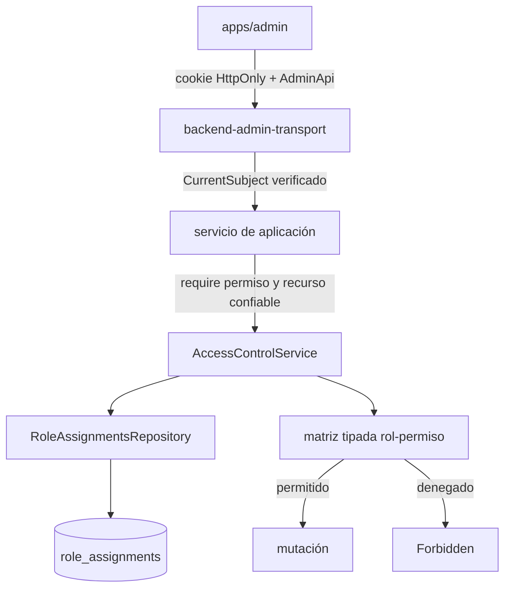

# Control de acceso

## Estado y autoridad

Identity autentica cuentas; Access Control decide qué pueden hacer. Una sesión válida no concede acceso administrativo por sí sola. La autoridad reside siempre en los casos de uso del servidor:



El engine está adaptado dentro de `packages/backend-domain/src/modules/access-control/engine`; su atribución está en `THIRD_PARTY_NOTICES.md`. Existe una única definición canónica de roles, permisos y scopes. No se ejecuta en Shared ni en el frontend.

## Modelo efectivo

Roles: `admin`, `catalog-editor`, `student`.

Permisos:

- `studyCatalog:createNode`
- `studyCatalog:connect`
- `studyNode:rename`
- `studyNode:archive`
- `studyEdge:disconnect`

Scopes: `studyCatalog`, `studyNode` y `studyEdge`. El scope global del catálogo usa `studyCatalog/global`; los recursos concretos usan su ID y heredan el scope global según la política de Domain. Para recursos existentes el orden obligatorio es:

```text
cargar recurso → construir resource/scopes desde datos persistidos → require → mutar
```

Nunca se acepta como autoridad un `userId`, rol, permiso, parent scope o capability aportado por el cliente. `role_assignments` impone unicidad de asignación; el servicio valida combinaciones role/scope y no permite retirar el último administrador global.

## HTTP y frontend

Todas las rutas de `AdminApi` protegidas resuelven la misma sesión opaca que la API pública. La política de borde es:

- cookie ausente, inválida, expirada o cuenta no activa: `401`;
- identidad válida sin permiso: `403` genérico;
- fallo de RoleStore: `500` seguro, nunca `403`;
- errores funcionales conservan su contrato.

`GET /admin/access-control/capabilities` devuelve permisos efectivos. `POST /admin/access-control/roles` concede y `DELETE /admin/access-control/roles` revoca; ambas operaciones requieren administrador global. La UI consume capabilities para presentar controles y falla cerrada si no puede cargarlas, pero cada mutación vuelve a autorizarse en backend.

## Persistencia y procesos

La sesión y las asignaciones deben proceder de la misma base lógica para los servidores público y administrativo. PGlite es adecuado para tests o un único proceso; dos servidores con directorios PGlite separados no comparten identidad. Para QA integrada con ambos servidores se usa PostgreSQL 17.

## Amenazas y controles

| Amenaza | Control actual | Riesgo pendiente |
| --- | --- | --- |
| IDOR / scope fabricado | Resource y parents se cargan del repository antes de `require` | Añadir tests por cada nuevo recurso/scope |
| Confiar en ocultación UI | Autorización en service; capabilities solo presentan | Ninguno si nuevos casos de uso mantienen el patrón |
| Escalada mediante gestión de roles | Solo admin global; combinaciones validadas; último admin protegido | Auditoría durable de grants/revokes pendiente |
| Confundir fallo de store con denegación | Error tipado y `500` fail-closed | Observabilidad/alertas de producción pendiente |
| Sesión robada/reutilizada | Token opaco hasheado, expiración, rotación y revocación | Protección CSRF explícita si se introducen cookies `SameSite=None` |
| Fixture QA en producción | Comando exige `NODE_ENV=development|test`; adapters dev se rechazan en root prod | Separar credenciales/secretos operativos reales |

## Pruebas obligatorias

- anónimo `401`; estudiante `403`; editor/admin solo según capability;
- denegación no toca el repository de la mutación;
- scope correcto permite y scope distinto deniega;
- fallo de RoleStore produce `500` seguro;
- revocación afecta a la siguiente request;
- grant/revoke solo por admin y protección del último admin;
- fallo al cargar capabilities deja Admin cerrado.
