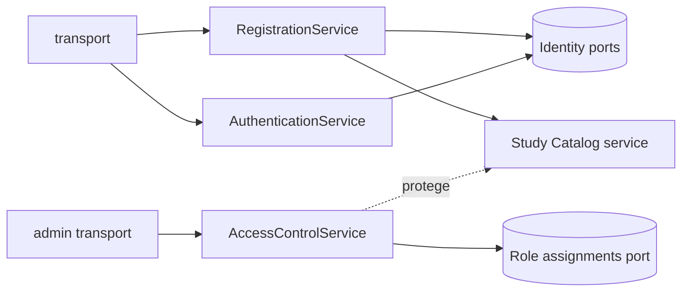

# Arquitectura de dominio de Proxus

> **Estado:** normativa de arquitectura
>
> **Alcance:** backend Effect, contratos compartidos y procesos ejecutables
>
> **Última revisión:** 2026-08-13

## Organización

Proxus organiza cada capacidad como un bounded context con el mismo nombre en las capas que realmente participan. Study Catalog está distribuido así:

```text
packages/shared/src/modules/study-catalog/                 contrato de wire
packages/backend-domain/src/modules/study-catalog/         modelo, ports y casos de uso
packages/backend-infra/src/modules/study-catalog/          adapters Drizzle
packages/backend-transport/src/modules/study-catalog/      HTTP público
packages/backend-admin-transport/src/modules/study-catalog/ HTTP administrativo
```

Feature Flags usa el mismo flujo completo para distribuir snapshots públicos:
`shared` define el wire snapshot, Domain lee el snapshot activo mediante un
repository port, Infra persiste revisiones completas en PostgreSQL (y usa
PGlite solo dentro de un proceso de desarrollo/test) y el transport público
aplica caché HTTP. La identidad de instalación y la evaluación
son frontend-only y no cruzan al backend.

No todos los contexts necesitan todas las capas. No se crean packages, directorios ni wrappers vacíos para anticipar necesidades.

Identity & Access incorpora tres límites colaboradores:

- **Identity** posee cuentas, password/Google, challenges y sesiones; `RegistrationService` coordina altas y `AuthenticationService` acceso posterior.
- **Learner Profile/Onboarding** define username, año, necesidad, fuente de adquisición, estudio y asignatura. Study Catalog conserva la autoridad sobre el grafo: el alta recibe la asignatura y deriva de ella el estudio padre, sin persistir la ruta de navegación del cliente.
- **Access Control** posee roles, scopes, capabilities y autorización; autenticarse no concede permisos administrativos.



Los contexts colaboran mediante servicios/ports públicos. Auth no importa Drizzle ni internals de catálogo, y Access Control recibe un subject verificado en lugar de confiar en IDs del request. Detalles de seguridad y adapters se documentan en [`identity-and-authentication.md`](./identity-and-authentication.md) y [`access-control.md`](./access-control.md).

### Lesson Plugins

Lesson Plugins es el límite de extensibilidad para implementaciones confiables
de tipos de lección compiladas con Proxus. `LessonTypeId` identifica un tipo
pedagógico estable y namespaced, por ejemplo `com.proxus.lesson-counter`; no
identifica una instancia de lección ni una revisión de contenido. Un
`LessonPluginManifest` v1 declara identidad, versión del plugin, versión mínima
del host y capabilities requeridas. Código ejecutable y configuración de
runtime no forman parte del contrato portable.

El backend compone `LessonPluginRegistry` desde una lista estática y explícita.
La construcción de la Layer valida todos los manifests antes de exponer el
registry y falla cerrada ante IDs duplicados, contratos o versiones inválidos,
host incompatible o capabilities ausentes. Los plugins no se autorregistran al
importarse. La fixture `com.proxus.lesson-counter` prueba este contrato sin
introducir todavía persistencia, transporte, Folder, UI o generación.

## Distribución backend de Feature Flags entre procesos

La publicación operativa se ejecuta en un proceso separado del servidor público.
Ese comando valida el snapshot publicable completo con `Schema`, rechaza la
revisión sintética `0`, comprueba que no haya migraciones pendientes y usa el
repository port para insertar y activar la revisión atómicamente. El servidor
público solo compone `FeatureFlagSnapshotReader` y lee la revisión activa desde
la misma base de datos PostgreSQL.

```text
publisher process → repository.publish → PostgreSQL
                                      ← repository.readActive ← public HTTP process
```

PostgreSQL es el mecanismo de distribución entre procesos. No existe un canal
push in-process: no podría observar publicaciones efectuadas por el proceso real
y añadiría una falsa garantía de entrega. Los clientes obtienen el snapshot por
HTTP y revalidan con `If-None-Match`; `ETag` y `Cache-Control` mantienen la
lectura pull-based eficiente sin introducir outbox, broker ni stream público.

## Packages y ejecutables

| Ubicación | Responsabilidad | Dependencias permitidas |
| --- | --- | --- |
| `packages/shared` | Schemas, errores y raíces `PublicApi`/`AdminApi`; `ProxusApi` solo para tooling/tests | Effect runtime-neutral |
| `packages/backend-domain` | Modelo interno, servicios y repository ports | `shared` |
| `packages/backend-infra` | Database, migraciones, seeds y adapters concretos | `backend-domain`, `shared` cuando el mapping lo requiere |
| `packages/backend-transport` | Handlers de `PublicApi` y traducción segura de errores | `backend-domain`, `shared` |
| `packages/backend-admin-transport` | Handlers de `AdminApi` y seam de identidad administrativa | `backend-domain`, `shared` |
| `apps/server` | Composition root del servidor público | domain + infra + transport público |
| `apps/admin-server` | Composition root del servidor administrativo | domain + infra + transport administrativo |

El flujo obligatorio es:

```text
HTTP handler → service/use case → repository port → adapter
```

Los ejecutables son los únicos lugares que conocen simultáneamente transport e infraestructura. No contienen reglas de producto.

## Dirección de dependencias

```text
shared ← backend-domain ← backend-transport ← apps/server
                    ↖ backend-admin-transport ← apps/admin-server
                    ← backend-infra ↗
```

Restricciones:

- Domain no importa HttpApi, SQL, Drizzle, Node ni SDKs cloud.
- Shared y Domain solo admiten `effect` en runtime y `vitest` desde tests como dependencias externas normativas.
- Los transports no importan Infra ni repositories concretos.
- El transport público no importa el transport administrativo ni `AdminApi`; el administrativo no importa el transport público ni `PublicApi`.
- `PublicApi` y `AdminApi` no se importan mutuamente; solo el agregado no productivo `ProxusApi` conoce ambos.
- Infra no importa transports.
- `apps/server` no importa `AdminApi` ni el transport administrativo.
- `apps/admin-server` no importa `PublicApi` ni el transport público.
- Ningún entrypoint productivo importa `ProxusApi`.
- Un módulo no importa internals o adapters de otro módulo; colabora mediante su superficie pública.

## Contratos y transporte

`packages/shared` contiene únicamente lo que cruza el límite proceso/cliente: IDs y modelos públicos, requests, responses, errores estables y contratos HttpApi. No contiene filas SQL, configuración del servidor ni implementación de repositories.

Los handlers adaptan transporte, invocan servicios y convierten errores internos a respuestas públicas seguras. El transporte resuelve la cookie opaca a una identidad verificada; la autorización de producto permanece en el servicio. Identity, onboarding y Access Control ya son casos reales: sus wire contracts viven en Shared, sus policies/ports en Domain y sus adapters Drizzle/crypto/proveedor en Infra.

## Infraestructura y persistencia

`backend-infra` es el propietario único de database, schema Drizzle, migraciones, checks y seeds. Los adapters implementan ports de Domain sin introducir decisiones de producto. PGlite cubre desarrollo y tests rápidos dentro de un único proceso; PostgreSQL cubre producción y cualquier desarrollo con dos procesos que deban compartir datos. No se ejecutan servidor y publisher simultáneamente contra un mismo `PGLITE_DATA_DIR`.

El desarrollo integrado usa `apps/dev-server`: un composition root no desplegable
que monta `PublicApi` y `AdminApi` en el mismo proceso y proporciona una única
`PgliteDevelopmentLive` a todos los repositories. Web y Admin siguen siendo
frontends independientes y conservan sus contratos/transports; únicamente
comparten lifecycle de base y servicios en esta composición. Los entrypoints
productivos `apps/server` y `apps/admin-server` permanecen separados y usan
PostgreSQL. Cada worktree posee naturalmente `apps/dev-server/.data`; no se
comparte ese directorio entre procesos.

Email y Google son puertos requeridos por Domain. Desarrollo usa adapters consola/fake; producción los rechaza y falla cerrada hasta que existan adapters reales, según [`identity-and-authentication.md`](./identity-and-authentication.md). Object storage permanece local al ejecutable mientras no implemente un port requerido por Domain. No se extrae una abstracción sin un consumidor real.

## Frontend

Los clientes públicos se generan desde `PublicApi`. Admin compone un cliente `AdminApi` para mutaciones/consultas administrativas y otro `PublicApi` para lecturas públicas. En local pueden usar URLs distintas; la composición cloud declarada coloca ambos backends como sidecars del frontend administrativo, mientras la web production sirve `/api` por load balancer hacia la API pública. Ese hosting no fusiona contratos ni composition roots backend. Feature Flags se lee únicamente mediante el port `FeatureFlagDistribution` y el `snapshotAtom` creado por `makeFeatureFlagSnapshotModule`; su `lifecycleAtom` hace polling scoped en la raíz de cada aplicación y el adapter web usa el cliente HTTP tipado y la caché condicional del navegador. El flujo es:

```text
view → atom → application client o platform port → adapter
```

La lógica neutral vive en `frontend-core`; `apps/web` posee sus adapters de navegador y compone runtime, pantallas y rutas. El contrato de rutas del producto público vive en `@proxus/frontend-core/public-product`: web y futuros clientes nativos comparten destinos y flujo salvo una diferencia de producto explícita. Un futuro cliente nativo seleccionará adapters propios de navegación, almacenamiento y HTTP; no dependerá de internals de Web. Consulta `docs/webapp-architecture.md` y `docs/effect/90_react_and_effect_atom.md`.

## Límite de infraestructura cloud

`infra` es un workspace técnico, no un bounded context ni una capa del flujo de dominio. Declara foundation, production y previews GCP, pero no importa ni ejecuta reglas de producto. Los builds backend seleccionan los entrypoints productivos de `apps/server` y `apps/admin-server`, que usan PostgreSQL; `apps/dev-server` y PGlite quedan fuera de las imágenes. Cloud Build construye/publica cuatro imágenes y Alchemy las consume por digest. El hosting administrativo multi-container no autoriza a saltarse servicios: cada API conserva `handler → service → port → adapter`.

La IaC de production referencia un ID de Secret Manager para la URL de PostgreSQL y otros secretos; previews usa Cloud SQL IAM sin contraseñas. No posee los valores de los secretos. Consulta [`../infrastructure/gcp-alchemy.md`](../infrastructure/gcp-alchemy.md) para el estado real: el cutover de foundation y preview-platform está completado; production y los runtimes preview siguen pendientes.

## Testing

- Domain: modelo y servicio con repository memory, incluida la política pública de nodos/edges publicados y lecturas admin sin ese filtro.
- Infra: contrato de repository, constraints, upgrades poblados, locks de sources y seeds con PGlite; el gate mínimo PostgreSQL 17 valida además el driver real, migraciones, Feature Flags y el orden global source(s)-antes-de-edge con inserts, update/remove y retry tras cambio concurrente de source según `docs/testing.md`.
- Transports: servicio sustituido en su interface; adaptación, status y errores. Feature Flags cubre `If-None-Match`, `200`, `304` y el `500` seguro.
- Composition roots: clientes tipados, persistencia real, ausencia de rutas cruzadas y límite raw de 256 KiB anterior al decoder con respuesta 413.
- Frontend: atoms con Layers de test y comportamiento observable de componentes.

`pnpm boundaries` aplica estas direcciones y la separación public/admin con dependency-cruiser, excluyendo árboles generados. No se presenta `verify:architecture` como check disponible porque no existe ese script en el workspace.
