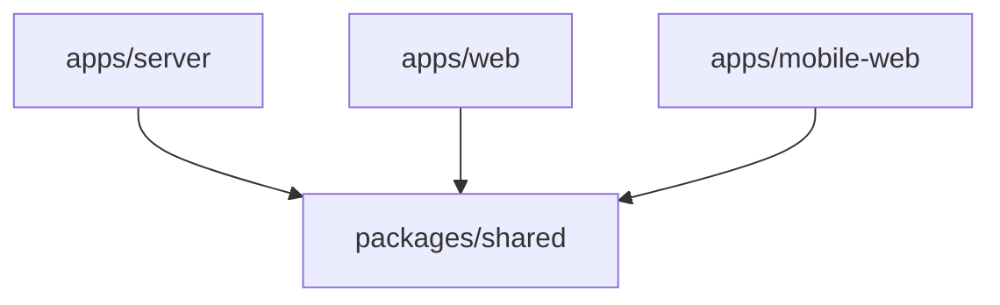

# Arquitectura de dominio de Proxus

> **Estado:** normativa de arquitectura (junto con [`docs/effect/`](../effect/))  
> **Alcance:** backend Effect, contratos compartidos y procesos ejecutables  
> **Última revisión:** 2026-07-14

## Propósito

Proxus organiza el producto con ideas de **Domain-Driven Design (DDD)** dentro del monorepo Effect ya definido en [`adoption-and-project-structure.md`](../effect/adoption-and-project-structure.md):

1. **Capacidades verticales** (`<module>`): concentran el lenguaje, el comportamiento y los seams de cada área de negocio.
2. **Contrato horizontal** (`packages/shared`): expone solo lo que cruza el límite proceso/cliente (schemas, HttpApi, errores públicos).
3. **Apps ejecutables** (`apps/server`, `apps/web`, `apps/mobile-web`, y más adelante worker/CLI si hace falta): composition roots que eligen adapters, Layers y transporte.

El objetivo es que HTTP (y, cuando existan, jobs o comandos) reutilicen el **mismo servicio de aplicación** sin duplicar reglas ni acoplarse entre procesos.

Este documento describe **cómo nombrar y delimitar contexts en el layout Effect del repo**. No propone un segundo árbol paralelo (`packages/domain`, `packages/infra`, etc.) mientras el código vive en shells; el primer slice de producto se implementa como `<module>` en `shared` + `server` según las reglas Effect.

## Relación con `docs/effect`

| Concepto DDD | Ubicación en Proxus v2 | Notas |
| --- | --- | --- |
| Bounded context | `<module>` alineado en `packages/shared` y `apps/server` (y UI en `apps/web` / `apps/mobile-web`) | Mismo nombre de módulo en cada capa |
| Modelo e invariantes | `packages/shared/.../schema.ts` + lógica pura en el servicio cuando convenga | IDs públicos con schemas; sin filas SQL en shared |
| Application / caso de uso | `apps/server/src/modules/<module>/service.ts` (+ `service.live.ts`) | Servicios Effect; coordinan repos y políticas |
| Port | `repository.ts`, otros `*.ts` de interfaz en el módulo | La interfaz es la superficie de test |
| Adapter | `repository.memory.ts`, `repository.sql.ts`, `repository.postgres.ts`, etc. | Sin comportamiento de producto |
| Contrato de wire | `packages/shared/.../contract.ts`, `api.ts`, `errors.ts` | Runtime-neutral; no es el modelo interno |
| Entrada HTTP | `handlers.ts` en el módulo + ensamblaje en `apps/server/src/http` | Handler delgado |
| Composition root | `apps/server/src/layers/ServerLayers.ts` | Entrypoints finos (`dev.ts`, prod) consumen Layers canónicos |
| Infra transversal | `apps/server/src/database/`, `observability/`, `errors/` | SQL, migraciones, telemetría |

Flujo obligatorio en backend:

```text
HTTP handler → service (caso de uso) → repository (port) → adapter SQL/memoria
```

La guía detallada de Effect (schemas, HttpApi, Layers, tests) sigue en [`docs/effect/`](../effect/). Este documento fija **límites entre módulos** y **vocabulario DDD** sobre ese layout.

## Principios

- El código se agrupa primero por **concepto de negocio** (`<module>`) y después por rol técnico (handler, service, repository).
- El **servicio** no importa handlers HTTP, clientes SQL concretos ni SDKs de proveedor; depende de interfaces y de tipos del contrato compartido cuando serializa hacia fuera.
- `packages/shared` no importa apps ni Node/SQL/React.
- Cada app ejecutable es una **composition root**: configura Layers y adapters; no define reglas de negocio.
- Los handlers, jobs futuros y comandos futuros **llaman al servicio**; no acceden a repositories ni reimplementan invariantes.
- Los módulos colaboran por la **interfaz pública** del otro módulo (`index.ts`), IDs de dominio publicados y errores compartidos; no importan `internal/` ni adapters de otro módulo.
- Los seams (repository memory + SQL, cliente fake + live) aparecen cuando hay **variación real** o tests que lo exigen, no por anticipación.
- El vocabulario de negocio se documentará en un `CONTEXT.md` en la raíz del repo cuando exista el primer dominio estable; hasta entonces, el lenguaje vive en nombres de `<module>` y en ADRs bajo `docs/`.

## Estructura objetivo (monorepo actual)

```text
apps/
  server/
    src/
      database/              # clientes SQL, migraciones, seed
      errors/                # errores solo servidor
      http/                  # ensamblaje HttpApi, middleware
      layers/                # ServerLayers.ts — composición canónica
      modules/<module>/      # producto por bounded context
      observability/
      test/
  web/
    src/
      api/                   # cliente tipado / config runtime
      modules/<module>/      # átomos y UI de feature
  mobile-web/
    src/                     # misma idea que web cuando aplique

packages/
  shared/
    src/
      api.ts                 # HttpApi raíz
      modules/<module>/      # contrato runtime-neutral por context
```

`apps/worker` y `apps/cli` se añadirán **solo cuando** un caso de uso deba ejecutarse fuera del proceso HTTP; compartirán los mismos `service`/`repository` vía Layers, sin importar `apps/server/src/http`.

Los nombres `<module>` son ilustrativos hasta que el negocio fije contexts reales. No crear carpetas de módulo vacías.

## Dirección de dependencias



Dentro de `apps/server`, la cadena por módulo es:

```text
handlers.ts → service.ts → repository.ts (interfaz)
                              ↑
                    repository.*.ts (adapters en el mismo módulo)
```

| Ubicación | Responsabilidad | Puede depender de |
| --- | --- | --- |
| `packages/shared/modules/<module>` | Schemas públicos, DTOs, HttpApi, errores visibles al cliente | Librerías de schema/validación; otros módulos shared solo vía su `index.ts` |
| `apps/server/modules/<module>` | Servicio, ports, adapters, handlers del módulo | `packages/shared`, otros módulos server vía `index.ts`, infra transversal del server (`database`, etc.) |
| `apps/server/src/http` | Router, middleware, registro de handlers | Módulos server (handlers), Layers |
| `apps/server/src/layers` | Composición de Layers y dependencias de runtime | Módulos e infra del server |
| `apps/web`, `apps/mobile-web` | UI y cliente tipado | `packages/shared` |

### Dependencias prohibidas

- `packages/shared` → cualquier `apps/*`
- `handlers` → `repository.*.ts` (adapter concreto)
- `service` → adapter SQL concreto (solo la interfaz `repository.ts` y servicios inyectados)
- Módulo A → `internal/` o adapters de módulo B
- `apps/web` / `apps/mobile-web` → `apps/server` (solo contrato shared + HTTP en runtime)
- Apps ejecutables entre sí (`worker` → `server` cuando existan)

Comprobación automática (cuando el tooling esté cableado en el repo):

```bash
pnpm boundaries
pnpm verify:architecture
```

## Un bounded context = un `<module>`

La **locality** del comportamiento vive en `apps/server/src/modules/<module>/`. El contrato cruzado vive en `packages/shared/src/modules/<module>/`.

Ejemplo (nombres ficticios):

```text
packages/shared/src/modules/rewards/
  schema.ts
  contract.ts
  errors.ts
  api.ts
  index.ts

apps/server/src/modules/rewards/
  handlers.ts
  service.ts
  service.live.ts
  repository.ts
  repository.memory.ts
  repository.sql.ts
  index.ts
  *.test.ts
```

Un handler HTTP y un job futuro llamarían al **mismo** servicio (`service.ts`), cada uno desde su entrypoint y Layer.

Contenido esperado del módulo server:

- **`service.ts`**: casos de uso, autorización de producto, coordinación de repos, transacciones cuando haya invariantes multi-repo, mapeo a modelos shared.
- **`repository.ts`**: schemas de persistencia agnósticos e interfaz del port.
- **`handlers.ts`**: decode/autenticación/llamada al servicio/encode; errores públicos del shared.
- **`index.ts`**: exportación deliberada hacia otros módulos (superficie pequeña).

No hay carpetas globales `entities/` o `repositories/` a nivel de todo el servidor.

## Colaboración entre contexts (módulos)

Los módulos **pueden** colaborar; no deben ver implementación interna del otro.

Permitido:

```text
rewards → accounts/index.ts   # solo API pública exportada
rewards → AccountId           # tipo publicado por accounts en shared
```

Prohibido:

```text
rewards → accounts/repository.sql.ts
rewards → accounts/internal/...
```

Mecanismos preferidos:

1. IDs y tipos en `packages/shared` del módulo propietario.
2. Operaciones expuestas como servicio público del módulo (vía `index.ts` y Layers).
3. Eventos o outbox cuando la colaboración sea asíncrona (diseño concreto en ADR cuando exista).
4. Ports solo cuando el caller deba invertir el control.

Mantener una allowlist verificable de dependencias entre módulos. Un `shared-kernel` mínimo en `packages/shared` solo para conceptos genuinamente compartidos (p. ej. IDs de tenant), nunca como cajón de sastre.

## Infraestructura y adapters

- **Por módulo**: implementaciones `repository.*.ts`, clientes externos encapsulados en el módulo o en `internal/`.
- **Transversal**: `apps/server/src/database/` (Effect SQL, migraciones), observabilidad, errores de servidor.

Reglas alineadas con Effect:

- Un adapter no contiene reglas de producto.
- Memory + SQL (o SQLite de test + Postgres) justifican el port; un solo backend no obliga a abstraer cada función.
- La composición de qué adapter usa cada entorno vive en `ServerLayers.ts`, no dispersa en servicios.

## Apps y composition roots

### Server

- Carga config, ejecuta migraciones en startup según [`docs/effect`](../effect/), construye `DevServerDependenciesLayer` / `ProdServerDependenciesLayer`.
- `http/` registra grupos HttpApi y middleware; los handlers delegan en módulos.

Pipeline del handler:

```text
decode request → authenticate/authorize → service → encode response
```

### Web y mobile-web

- Consumen `packages/shared` mediante cliente tipado generado desde HttpApi.
- Pantallas finas; sin lógica de dominio duplicada ni acceso directo a SQL.

### Worker y CLI (futuro)

- Misma regla: entrypoint fino + Layers que proveen los mismos servicios/repositories.
- Prohibido importar handlers o capas HTTP del server.

## Contratos de wire (`packages/shared`)

Ya es el paquete de contrato del repo (no un `packages/contracts` separado).

Puede contener:

- schemas de dominio **público** (vista cliente);
- request/response y grupos HttpApi;
- errores con status y cuerpo esperados por el cliente.

No debe contener:

- filas SQL ni tipos de driver;
- implementaciones de repository;
- lógica de casos de uso.

El servicio traduce entre persistencia interna y modelos/errores del shared en el límite HTTP.

## Testing

Coherente con [`testing.md`](../effect/testing.md):

- Modelo y reglas puras: tests unitarios sin infra.
- Servicio: tests con `repository.memory.ts` (o dobles del port).
- Adapters persistentes: SQL aislado temporal; contract tests compartidos si hay varios adapters del mismo port.
- HTTP: integración del router y e2e con cliente tipado + SQLite temporal.
- Layers: smoke de que la composición canónica arranca con la config esperada.

No acoplarse a internals de otro módulo salvo en tests de ese módulo.

## Estrategia de adopción (greenfield)

El repo está en shells; no hay migración desde tRPC ni un `server/` legacy en este tree.

Orden recomendado para el **primer** bounded context:

1. Fijar nombre y responsabilidad del `<module>` (ADR o nota en `docs/`).
2. Crear `packages/shared/src/modules/<module>/` (schema, errors, api).
3. Crear `apps/server/src/modules/<module>/` (repository, service, handlers, tests).
4. Registrar handlers y Layers en `http/` y `ServerLayers.ts`.
5. Añadir superficie mínima en `apps/web` o `apps/mobile-web` si hay UI.
6. Activar `pnpm boundaries` / `verify:architecture` cuando existan reglas en el workspace.
7. Repetir módulo a módulo; extraer worker/CLI solo con un caller no-HTTP real.

No crear `packages/domain`, `packages/infra` ni apps placeholder hasta que un ADR justifique separación física (equipos, despliegue o tiempos de build).

## No objetivos

Esta arquitectura no pretende:

- duplicar la normativa Effect en otro árbol de carpetas;
- un package npm por bounded context desde el día uno;
- desplegar cada context por separado sin necesidad;
- un port por cada función;
- comunicación solo asíncrona entre módulos;
- implementar todo el backend en un solo cambio.

## Cuándo revisar la estructura

Reevaluar módulos vs packages físicos (`domain` / `infra` separados) si aparecen:

- equipos con ciclos de entrega independientes;
- despliegue o versionado por context;
- reglas de import demasiado complejas en un solo `apps/server`;
- tiempos de build/test que exijan aislamiento.

Mientras no existan, **módulos verticales en shared + server** mantienen locality, alineación con Effect y coste operativo bajo.