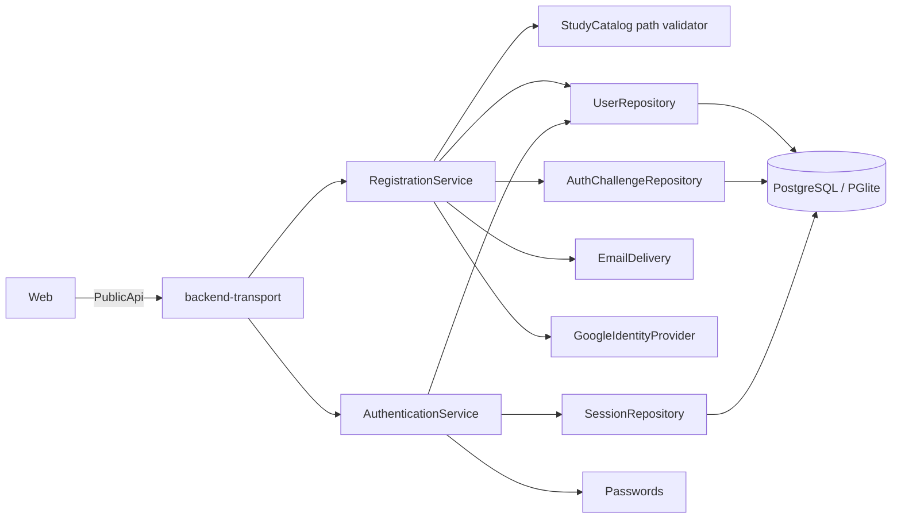

# Identity, autenticación y onboarding

## Límites y flujo

Identity es dueño de cuentas, credenciales password/Google, challenges y sesiones. Learner Profile/Onboarding conserva username, año de nacimiento, necesidad y una referencia validada al path de Study Catalog. Access Control consume el subject autenticado, pero es un bounded context separado.

Los handlers solo adaptan HTTP/cookies. Los servicios coordinan reglas y puertos; Infra implementa hashing, generación segura, delivery, proveedor y repositorios Drizzle.

## Sesiones y challenges

La cookie contiene un token opaco; solo su hash se persiste. Es `HttpOnly`, `SameSite=Lax` y `Secure` en la composición actual. Una sesión dura 30 días, entra en renovación deslizante durante los últimos 7 y conserva 10 segundos de gracia al rotar. Logout revoca la actual; reset de password revoca todas.

Los códigos de verificación/reset son de seis dígitos, hasheados, de un uso, con propósito, TTL de 15 minutos y máximo cinco intentos. Reenvío de verificación tiene cooldown de 60 segundos. Solicitud de reset y reenvío responden de forma neutra para evitar enumeración.

## Google y email: adapters actuales

Desarrollo compone `ConsoleEmailDelivery` y `FakeGoogleIdentityProvider`. El email consola es el único lugar autorizado para mostrar códigos y el fake acepta el código determinista de desarrollo. Producción falla al seleccionar `AUTH_EMAIL_ADAPTER=console` o `AUTH_GOOGLE_ADAPTER=fake`; además, los placeholders reales fallan cerrados. Por tanto **email y Google reales aún no están implementados**.

Camino a producción, sin cambiar Domain ni contratos:

1. Implementar `EmailDelivery` con un proveedor transaccional; templates versionados, TLS, retries acotados, idempotency key y redacción de destinatario/código en logs.
2. Implementar `GoogleIdentityProvider` authorization-code con discovery/JWKS y PKCE cuando aplique; validar `state`, `nonce`, issuer, audience, expiración y `email_verified` antes de producir `VerifiedGoogleIdentity`.
3. Inyectar credenciales mediante `Config.redacted`, añadir health/observabilidad y pruebas contractuales contra sandbox; nunca hacer fallback a fake/console.
4. Habilitar adapters mediante valores explícitos distintos de los reservados de desarrollo, desplegar primero en staging y conservar el gate fail-fast.
5. Revisar redirect URIs, orígenes, política de cookies y proxy TLS por entorno; rotar `AUTH_GOOGLE_SIGNING_SECRET` con estrategia compatible con pendientes en vuelo.

## Amenazas

| Amenaza | Mitigación | Pendiente antes de producción |
| --- | --- | --- |
| Robo de password | Hash adaptativo; credenciales genéricas | Política/rate limiting distribuido y parámetros operativos revisados |
| Robo de token/código | Hash en DB, TTL, uso único, cookie HttpOnly | CSP, TLS/HSTS y detección de abuso |
| Enumeración de cuenta | Respuestas neutras de reset/reenvío | Homogeneizar métricas/timing bajo carga |
| Replay de Google | state/nonce firmados y con TTL; callback server-side | Adapter real con issuer/audience/JWKS y PKCE |
| Auto-link hostil | Solo email verificado y cuenta activa; unicidad transaccional | Alertas de link y recuperación operativa |
| CSRF | SameSite=Lax y mutaciones no-GET | Token/origin check si cambian topología o SameSite |
| XSS/filtración frontend | secretos fuera de URL/session storage; cookie HttpOnly | CSP estricta y auditoría de dependencias |
| Adapter dev en prod | gate de composición fail-fast | Deployment test que arranque cada imagen con config real |
| Abuso de códigos/login | expiración, intentos y cooldown | Rate limit por cuenta/IP y protección anti-bot |

No se registran passwords, tokens, hashes, códigos, secretos de firma ni perfiles Google no verificados. Los errores de infraestructura se transforman a respuestas seguras.
