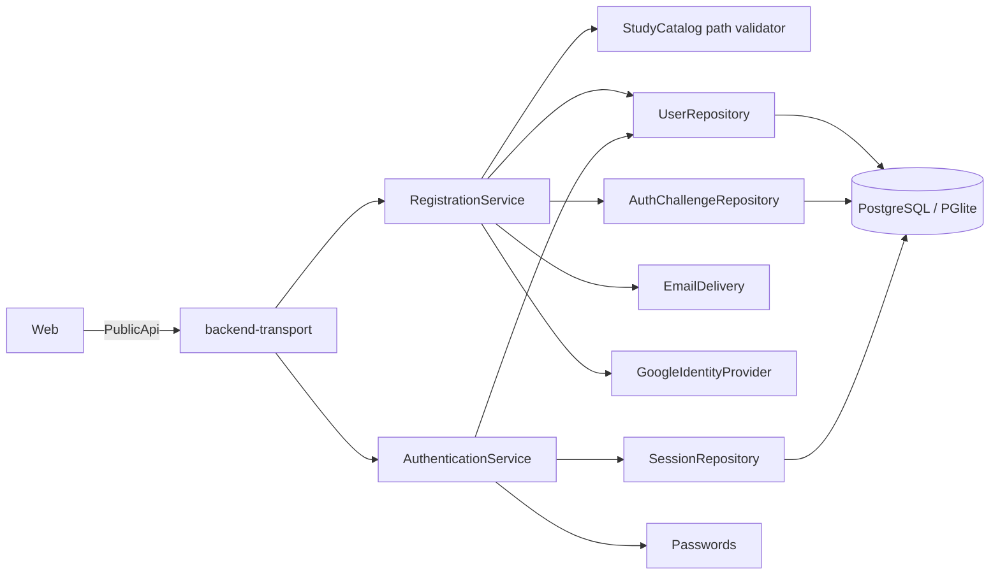

# Identity, autenticación y onboarding

## Límites y flujo

Identity es dueño de cuentas, credenciales password/Google, challenges y sesiones. Learner Profile/Onboarding conserva username, año de nacimiento, necesidad y una referencia validada al path de Study Catalog. Access Control consume el subject autenticado, pero es un bounded context separado.

Los handlers solo adaptan HTTP/cookies. Los servicios coordinan reglas y puertos; Infra implementa hashing, generación segura, delivery, proveedor y repositorios Drizzle.

## Sesiones y challenges

La cookie contiene un token opaco; solo su hash se persiste. Es `HttpOnly` y `SameSite=Lax`; producción exige además `Secure`. Solo la composición local de `apps/dev-server` omite `Secure`. Los previews cloud declarados ejecutan `NODE_ENV=production` detrás de IAP directo y mantienen HTTPS/cookie segura; no usan el root de desarrollo. Una sesión dura 30 días, entra en renovación deslizante durante los últimos 7 y conserva 10 segundos de gracia al rotar. Logout revoca la actual; reset de password revoca todas.

Los códigos de verificación/reset son de seis dígitos, hasheados, de un uso, con propósito, TTL de 15 minutos y máximo cinco intentos. Reenvío de verificación tiene cooldown de 60 segundos. Solicitud de reset y reenvío responden de forma neutra para evitar enumeración.

## Google y email: adapters actuales

Desarrollo compone `ConsoleEmailDelivery` y `FakeGoogleIdentityProvider`. El email consola es el único lugar autorizado para mostrar códigos y el fake acepta el código determinista de desarrollo. Producción exige exactamente `AUTH_EMAIL_ADAPTER=mailgun` y `AUTH_GOOGLE_ADAPTER=real`; cualquier otro selector falla el arranque.

El adapter productivo de email usa Mailgun mediante `mailgun.js`, el endpoint europeo por defecto y una llamada limitada a diez segundos. `MAILGUN_API_KEY` se lee con `Config.redacted`; dominio y remitente son configuración obligatoria. Los mensajes de verificación y reset exigen TLS y desactivan tracking de aperturas/clics para no exponer códigos. Los errores conservan únicamente proveedor, tipo y status seguro, nunca destinatario, código, API key ni cuerpo remoto. Preview/production reciben la API key desde Secret Manager y Pulumi solo conserva el ID del secreto.

El adapter real de Google continúa pendiente y falla sus operaciones de proveedor de forma cerrada. Antes de declarar el runtime listo aún hay que:

1. Implementar `GoogleIdentityProvider` authorization-code con discovery/JWKS y PKCE cuando aplique; validar `state`, `nonce`, issuer, audience, expiración y `email_verified` antes de producir `VerifiedGoogleIdentity`.
2. Validar Mailgun contra su dominio real y ejecutar pruebas de entrega sin registrar destinatarios/códigos. El port actual no ofrece una clave de idempotencia durable; por ello el adapter no hace retries automáticos de POST que puedan duplicar códigos.
3. Añadir health/observabilidad segura y pruebas contractuales contra sandbox; nunca hacer fallback a fake/console.
4. Revisar redirect URIs, orígenes, política de cookies y proxy TLS por entorno; rotar `AUTH_GOOGLE_SIGNING_SECRET` con estrategia compatible con pendientes en vuelo.

## Amenazas

| Amenaza | Mitigación | Pendiente antes de producción |
| --- | --- | --- |
| Robo de password | Hash adaptativo; credenciales genéricas | Política/rate limiting distribuido y parámetros operativos revisados |
| Robo de token/código | Hash en DB, TTL, uso único, cookie HttpOnly | CSP, TLS/HSTS y detección de abuso |
| Enumeración de cuenta | Respuestas neutras de reset/reenvío | Homogeneizar métricas/timing bajo carga |
| Replay de Google | state/nonce firmados y con TTL; callback server-side | Adapter real con issuer/audience/JWKS y PKCE |
| Auto-link hostil | Solo email verificado y cuenta activa; unicidad transaccional | Alertas de link y recuperación operativa |
| CSRF | SameSite=Lax y mutaciones no-GET | Token/origin check si cambian topología o SameSite |
| XSS/filtración frontend | secretos fuera de URL/session storage; cookie HttpOnly | CSP estricta y auditoría de dependencias |
| Adapter dev en prod | gate de composición fail-fast | Deployment test que arranque cada imagen con config real |
| Abuso de códigos/login | expiración, intentos y cooldown | Rate limit por cuenta/IP y protección anti-bot |

No se registran passwords, tokens, hashes, códigos, secretos de firma ni perfiles Google no verificados. Los errores de infraestructura se transforman a respuestas seguras.

## Borde IAP y estado de despliegue

IAP autentica el acceso al servicio Cloud Run; no sustituye la sesión opaca de producto ni produce hoy un `AdminPrincipal` de dominio. La IaC concede acceso IAP a un principal de grupo configurable y `run.invoker` solo al service agent de IAP, sin principals públicos. Dentro de Admin, los handlers siguen resolviendo la cookie y Access Control sigue autorizando cada operación.

Esta defensa de plataforma está implementada en el programa Pulumi, pero no desplegada. `APPLICATION_RUNTIME_READY` debe permanecer cerrado hasta que existan los adapters reales de email/Google, secretos y smoke tests. Un grupo autorizado por IAP que no tenga sesión/capability Proxus recibe el resultado normal de autenticación/autorización de producto; pertenecer al grupo no crea una cuenta ni un rol.
